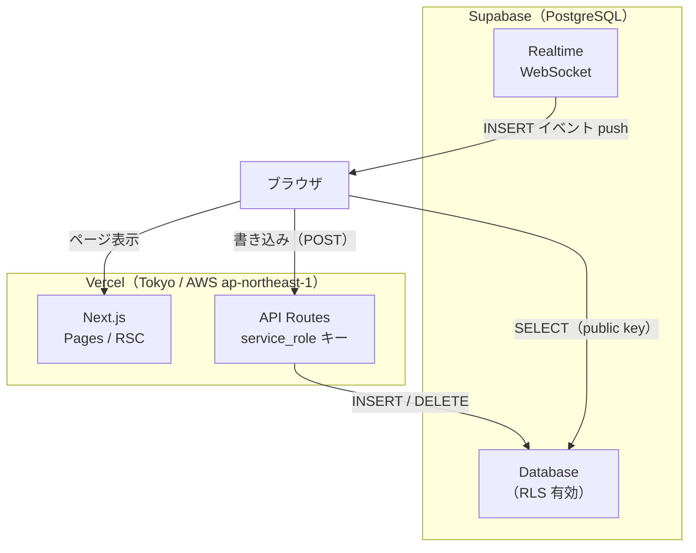

# 技術選定

作成日: 2026-05-19  
更新日: 2026-07-18

---

## アーキテクチャ概要

---

## 選定結果

| レイヤー | 技術 |
|---|---|
| フロントエンド | React + Next.js |
| バックエンド | Next.js API Routes |
| データベース | Supabase |
| ホスティング | Vercel |

---

## 各技術の選定理由

### React + Next.js

- フロントとバックを1つのリポジトリ・1つのフレームワークで完結できる
- API Routes がバックエンドの役割を果たすため、別サーバーが不要
- Vercel と同じ会社製でありデプロイ体験が最も優れている
- 1人開発かつ小規模アクセスのアプリにおいて、フロントとバックを分離するメリットがない

### Next.js API Routes（バックエンド）

- Next.js に内包されているため追加の技術（Hono・Express など）が不要
- 全書き込み操作をここに集約することで、クライアントから直接データベースを操作するセキュリティリスクを排除できる
- 想定アクセス規模では API Routes のスループットで十分

### Supabase

- PostgreSQL ベースのためデータを正規化でき、Firestore で発生していた playerName・tableName の非正規化問題を解消できる
- Row Level Security（RLS）により、Firestore Security Rules より直感的にアクセス制御を記述できる
- リアルタイムサブスクリプション機能があり、Firestore の `onSnapshot` 相当の挙動を実現できる
- 無料枠（DB 500MB・週次停止あり）でこのアプリの規模は十分に収まる

### Vercel

- Next.js との親和性が最も高く、設定なしでデプロイできる
- 無料枠で十分な規模のアプリである
- サーバー管理が不要

---

## 選定しなかった技術とその理由

| 技術 | 不採用理由 |
|---|---|
| Firestore | NoSQL のためデータ正規化が難しい。Security Rules の設定ミスによるセキュリティリスクがあった。Supabase に移行することで解消できる |
| Hono / Express | Next.js API Routes で十分なため不要。バックエンドを別サーバーに分けるメリットがない |
| SolidJS | React からの移行コストに対してメリットが薄い。Firebase 関連ライブラリのエコシステムも React の方が充実している |
| Firebase Hosting | Vercel の方が Next.js のデプロイ体験が優れている |
| Upstash Redis（レートリミット） | 2026-06 に採用したが 2026-07 に撤去。書き込みの認可（ログイン必須、または推測不能な大会 URL）だけで身内利用には十分であり、守った実績がない一方、データベースが消えた際に全書き込み API へ約4秒のリトライ遅延を課す実害が出たため。生フラッドは Vercel 標準の DDoS 保護に委ねる |
